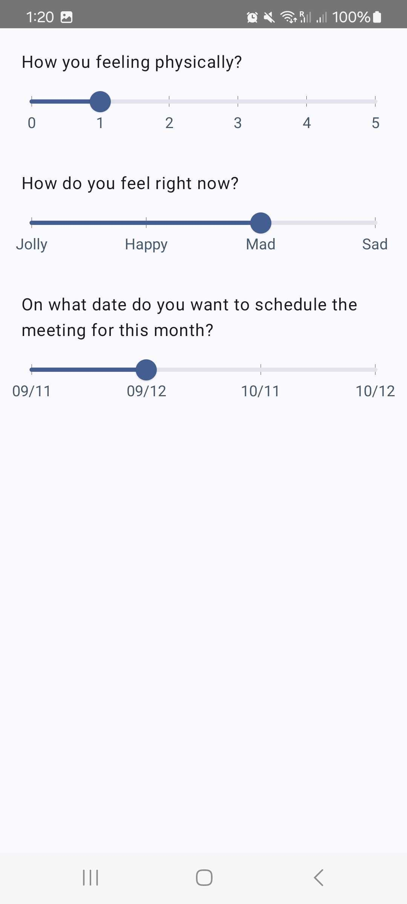
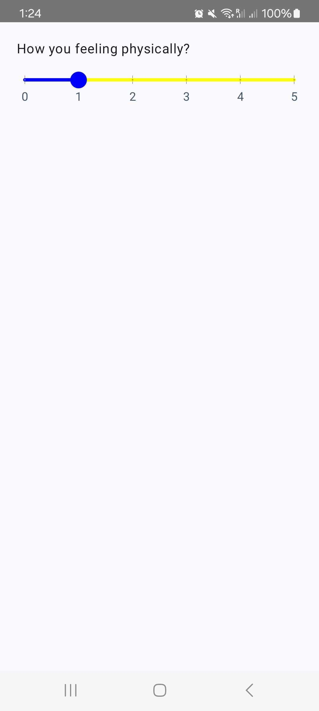

# Customizable Slider with Indicator for Jetpack Compose

[](https://jitpack.io/#jovelcasais/MyUIComponents)

This repository contains a custom slider component built using Jetpack Compose. The slider is customizable and can be easily integrated into any Android project using Jetpack Compose.

     


## Gradle Setup/Installation

To get a Git project into your build:


* Step 1. Add the JitPack repository to your build file Add it in your root build.gradle at the end
  of repositories:


```
dependencyResolutionManagement {
  repositoriesMode.set(RepositoriesMode.FAIL_ON_PROJECT_REPOS)
    repositories {
      mavenCentral()
      maven { url 'https://jitpack.io' }
    }
}
```


* Step 2. Add the dependency

```
dependencies {
  implementation("com.github.jovelcasais:MyUIComponents:1.2")
}
```


## Features

- Customizable range and step values
- Smooth sliding animations
- Easy integration with Jetpack Compose

```kotlin
@Composable
fun JCSlider(
    sliderModifier: Modifier = Modifier,
    sliderItems: List<String>, 
    value: Float, onValueChange: (Int) -> Unit, 
    sliderLineHeight : Dp = 10.dp,
    paddingTopIndicator : Dp = 50.dp, 
    showAllLabelIndicator : Boolean = true
    showLineIndicator: Boolean = true,
    sliderColors: SliderColors = customDefaultSliderColors(),
    indicatorTextSize : Float = 40f
) 
```


* **sliderModifier** - Lets you modify the Slider Layout.
* **sliderItems** - Current value of the Slider. Supports different data types.
* **value** - Current value of the slider.
* **sliderLineHeight** - Line height of the slider, default is 10.dp
* **paddingTopIndicator** - Distance padding top between the slider and the label indicator, default is 50.dp
* **showAllLabelIndicator** - Shows all label indicator if true
* **showLineIndicator** - Shows vertical line indicator/divider if true
* **sliderColors** - Let you modify the slider active, inactive and thumb tick solor
* **indicatorTextSize** - Text Size font size in float


Usage

```kotlin
setContent {
  MyUIComponentsTheme {
    Scaffold(modifier = Modifier.fillMaxSize()) {
      val sliderItems = listOf("0",  "1",  "2", "3", "4", "5") // label indicator below slider
      Column {
      JCSlider(
        sliderItems, 
        1f, 
        onValueChange = {
          Log.v("MySliderSelectedValue", it.toString())
        }, 
        showAllLabelIndicator = true
      ) 
    }
  }
}

```
